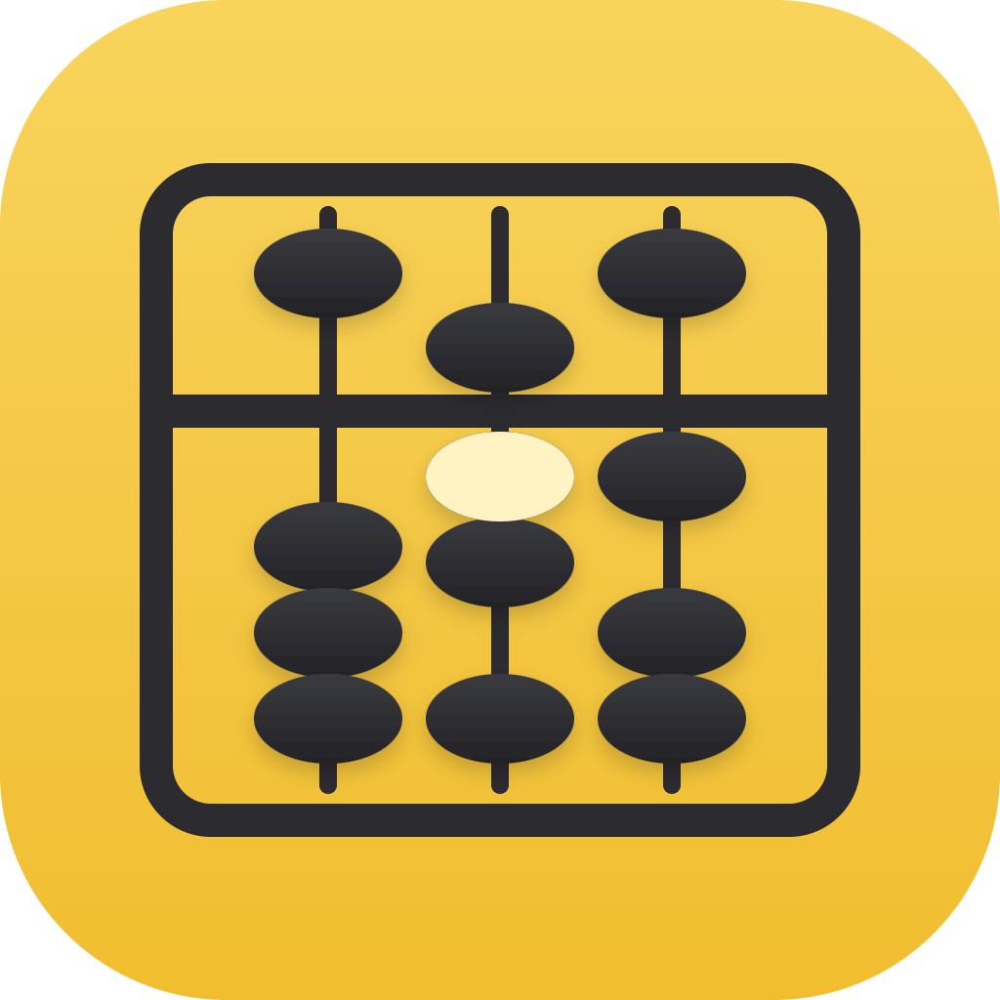

<p align="center"></p>

# そろばん（Soroban）

メルカリ販売の利益管理ツール。**単一の Electron アプリ、ローカル SQLite、外部サービスなし**。
Windows / macOS で動き、家族が毎日 1 件 10 秒で使えることを目標にしている。

```
いつ・何円で仕入れた商品が
  → メルカリに出品され（どの在庫を出したか＝引き当て）
    → 売れて（引き当てた在庫がそのまま紐付く）
      → 手数料と送料を引いて
        → 何円の利益になったか
```

---

## できること

| 領域 | 内容 |
|---|---|
| **取り込み** | メルカリの売却済み一覧・出品中一覧、メロジョイ（Shopify）の注文履歴を **1 時間に 1 回・数ページ** 読む。埋め込みブラウザでログインし、パスワードは保存しない。**キーワードに一致するものだけ**取り込む（メルカリ＝設定のキーワード、仕入先＝仕入先ごとの取り込みキーワード） |
| **売上** | 出品中｜売れた・要入力｜利益確定｜すべて の 4 段階。出品したら在庫を「引き当て」、売れたら送料と在庫の紐付けを入れると粗利が確定。型番が完全一致すれば自動。上部に今月のサマリと 12 か月のグラフ |
| **仕入** | メロジョイの注文履歴から自動（送料・割引は明細に按分）。手入力も可。到着状態（未着／配送中／到着済） |
| **在庫** | 1 点ずつ（按分後の原価を持つ）。未出品／出品中／販売済。分割・廃棄・自家消費・タグ・メモ |
| **商品** | 型番ごとの在庫数・平均原価・平均粗利・月ごとの推移 |
| **月次** | 売上・原価・手数料・送料・粗利・期間費用（振込手数料は月 1 回自動計上）・純利益 |
| **検索** | 各画面の検索（空白区切り AND、全角半角を無視）と、ヘッダの横断検索（Ctrl+K）で在庫／出品／売上／仕入を一度に |
| **タグ** | 仕入・在庫・販売に付けられ、仕入→在庫→販売へ自動で引き継がれて見える（コピーではなく派生） |
| **履歴** | 在庫 1 点の「仕入→到着→出品→売れた→発送→受取→入金」を時系列で |

---

## 画面

縦のナビ：**ホーム**（要対応・今月・型番ランキング）／**売上**／**仕入**／**在庫**／**商品**／**月次**／**設定**。

毎日の動線は「ホームの要対応 → 売上タブ」だけ。

- **出品中**：メルカリに出品した商品。どの在庫を出したかを引き当てる（「型番で自動引き当て」ボタンあり）。発送方法もここで決めておける
- **売れた・要入力**：売れた販売のうち、送料か在庫の入力が残っているもの。入れると利益確定へ
- **利益確定**：粗利が確定した販売

---

## セットアップ（開発）

必要なもの：**Node.js 20 以上**、**pnpm 10**（`corepack enable` で入る）。macOS は `xcode-select --install`（ネイティブモジュールのビルドに要る場合がある）。

```bash
pnpm install          # better-sqlite3 を Electron 向けにビルドする（postinstall）
pnpm dev              # 開発起動（実 DB を使う。起動時に取り込みが走ることがある）
pnpm typecheck        # 型チェック
pnpm test             # テスト（Electron の Node で vitest を回す。素の vitest は動かない）
```

画面の見た目だけ確認したいときは、Electron を起動せず mock データでブラウザに出す：

```bash
pnpm exec vite --config vite.review.config.ts --port 5199
```

`pnpm 10` は依存パッケージの build script を既定で走らせない。`better-sqlite3` のエラーが出たら：

```bash
pnpm approve-builds
pnpm electron-builder install-app-deps
```

---

## インストール（配布版を使う）

ビルドしなくても、GitHub の **Releases** から入れられる：https://github.com/namespace-git/soroban/releases/latest

| OS | ファイル | 入れ方 |
|---|---|---|
| macOS（Apple Silicon: M1〜） | `soroban-<版>-arm64.dmg` | dmg を開き「Soroban」を **Applications にドラッグ**（Dock やメニューでは「そろばん」と出る） |
| macOS（Intel） | `soroban-<版>-x64.dmg` | 同上 |
| Windows | `soroban-setup-<版>.exe` | ダブルクリック → インストール先を選んで進む |

どの Mac か分からないときは、 → 「このMacについて」で「チップ Apple M…」なら arm64。

### macOS の初回起動（署名なしアプリの開き方）

配布用の署名（Apple Developer Program）は付けていないので、初回だけ Gatekeeper に止められる。

ターミナルで隔離属性を外すのが確実（macOS 26 以降は「右クリック → 開く」だけでは通らないことがある）：

```bash
xattr -dr com.apple.quarantine /Applications/Soroban.app
```

そのあと普通にダブルクリックで起動できる。

2 回目以降は Launchpad や Dock から普通に起動できる。Dock に残しておけばデスクトップから 1 クリック。

### クリーンインストール（古い版を消してから入れ直す）

v0.1.8 以前の版は macOS で起動直後にクラッシュする（アプリ内部の名前が日本語だったため）。入れたことがある場合は、一度きれいに消してから最新版を入れる。**データ（DB）は別の場所にあるので消えない**が、念のため先にバックアップを取る。

macOS：

```bash
# 1. アプリを終了してから、本体を消す
rm -rf /Applications/Soroban.app /Applications/そろばん.app
# 2. 更新の一時ファイルとキャッシュを消す（DB は ~/Library/Application Support/soroban/soroban.db。消さない）
rm -rf ~/Library/Caches/jp.namespace.soroban ~/Library/Caches/soroban-updater
# 3. 最新の dmg を入れ直し、初回は右クリック → 開く
```

データごと完全に消してやり直すとき（**取引データも消える**。バックアップを取ってから）：

```bash
rm -rf ~/Library/Application Support/soroban
```

Windows：

1. 設定 → アプリ → 「そろばん」をアンインストール
2. `%LOCALAPPDATA%soroban-updater` があれば削除（更新の一時ファイル）
3. 最新の `soroban-setup-<版>.exe` を実行

データごと消すときは `%APPDATA%soroban` も削除（バックアップを取ってから）。

### 自分でビルドする（macOS）

ビルドは **Mac 上で**行う（Windows からは macOS 用の dmg は作れない）。

```bash
git clone https://github.com/namespace-git/soroban.git
cd soroban
corepack enable
pnpm install
pnpm dist:mac
```

`release/` に `soroban-<版>-arm64.dmg` と `soroban-<版>-x64.dmg` ができる。動作確認だけなら `pnpm pack:mac` → `open release/mac-arm64/Soroban.app`。

Windows は `pnpm dist:win` → `release/soroban-setup-<版>.exe`。

---

## 自動アップデート

アプリは **起動 10 秒後と 6 時間ごと**に GitHub Releases を確認し、新しい版があればヘッダの下に「新しいバージョン vX.Y.Z があります」と出す。設定タブの「アプリの更新」からも手動で確認できる。

| OS | 動き |
|---|---|
| **Windows** | 裏でダウンロードし、**次に終了するとき**に自動で入れ替わる（バナーの「再起動して更新」で今すぐも可） |
| **macOS** | Apple の署名が無いアプリは OS が自動入れ替えを拒否するため、「ダウンロード」で Releases のページを開く → dmg を開いて Applications に上書き（初回と同じく右クリック → 開く）。**DB はそのまま**で、起動時に自動で新しいスキーマへ移行する |

更新が見つからないとき：オフラインか、GitHub の API 制限（1 時間に 60 回）に当たっている。しばらく待つか、Releases のページを直接見る。

### リリースの出し方（開発者向け）

```bash
pnpm release:patch     # 0.1.6 → 0.1.7。バージョンを上げてタグを push
pnpm release:minor     # 0.1.6 → 0.2.0
```

タグ `v*` を push すると GitHub Actions（`.github/workflows/release.yml`）が動く：mac（macos-14 ランナー、arm64/x64 の dmg）と Windows（NSIS）をビルド → 最後に 1 つの Release にまとめて公開（`latest.yml` / `latest-mac.yml` を含む。Draft ではなく公開状態。Draft だとアプリの更新確認に見えない）。

---

## アイコン

`build/icon.svg` が原本。PNG は Electron で描画して作る（外部ツール不要）。

```bash
pnpm icon              # build/icon.svg → build/icon.png（1024×1024）
```

macOS の `.icns` と Windows の `.ico` は electron-builder が `build/icon.png` から自動生成する。

---

## 最初にやること（アプリ側）

1. 起動する
2. 右上の**「取り込む」**を押す → メルカリのログイン画面が埋め込みブラウザで開くので、普通にログインする（パスワードはアプリに保存されない。セッションだけ残る）
3. **設定**：
   - **キーワード**（例：`Mellojoy, メロジョイ`）。メルカリはこれに一致する販売・出品だけ取り込む
   - **仕入先**にメロジョイの口座を追加し、「ログイン」→ 口座ごとの**取り込みキーワード**を入れる（空なら全部）
   - **発送方法**の送料を確認する
4. もう一度「取り込む」。仕入・出品・販売が入る
5. **売上タブ**：出品中の行で「型番で自動引き当て」→ 残りは手で引き当て。売れた・要入力の行で発送方法と在庫を入れる

---

## データの保存先とバックアップ

| OS | パス |
|---|---|
| Windows | `%APPDATA%\soroban\soroban.db` |
| macOS | `~/Library/Application Support/soroban/soroban.db` |

設定タブの「保存フォルダを開く」から辿れる。**ローカル 1 ファイル**なので、月に 1 回は設定タブからバックアップを取ること。
アプリの更新時、DB は起動時に自動で新しいスキーマへ移行する（`setting.schema_version`）。心配なら起動前にコピーを取っておく。

### バックアップと復元

設定 → データ → **「バックアップを保存（zip）」**で、データベース・レシート画像・サムネ・操作ログ（14 日分）を
1 つの zip にまとめて保存できる。不具合の報告はこの zip ファイルを送ってもらえれば足りる。

戻すときは設定 → データ → **「バックアップから復元」**で zip（または古い形式の `.db` 単体）を選ぶ。
今のデータは自動で `userData/backup-before-restore-<日時>/` に退避されてから置き換わり、アプリが再起動する。
退避したものは消えないので、間違えて選んでも手動でそのフォルダから戻せる。

### 別のパソコンへの引っ越し

1. 元のパソコンで設定 → データ → 「バックアップを保存（zip）」
2. その zip を新しいパソコンに移し、そろばんをインストールしてから設定 → データ → 「バックアップから復元」で選ぶ

取り込みのログイン状態（Cookie 等）は zip に含まれないので、移した先でメルカリ・仕入先に改めてログインし直すこと。

---

## 取り込みの約束

- **読み取り専用**。出品・価格変更・メッセージなど、メルカリへの書き込みは一切しない
- **既定 1 時間間隔・1 回に数ページ・ページ間 2〜6 秒**。ロボットと名乗らず、普通の Chrome と同じ見え方で読む
- **CAPTCHA や本人確認が出たら止めて人に渡す**。自動突破はしない
- **0 件を成功にしない**。`empty` として記録し、ホームの要対応の先頭に出す
- **キーワードに一致しないものは取り込まない**（詳細ページ・画像も取りに行かない）

メルカリの利用規約は自動アクセスを制限している可能性がある。自分のアカウントの自分のデータを低頻度で読むだけの設計だが、リスクがゼロとは言えない。頻度を上げない・書き込まない・おかしければ止める、を守ること。

---

## トラブル

| 症状 | 対処 |
|---|---|
| ホームに「ログインが必要」 | セッション切れ。「ログインして取り込む」から入り直す |
| 取り込みが 0 件のまま／「構造が変わった可能性」 | メルカリの画面構造が変わった。`src/main/collector.ts` のパーサを実 DOM で直す（`src/main/__tests__/fixtures/` に HTML の見本） |
| 利益が合わない | 仕入の送料按分（仕入タブの総原価）→ まとめ売りの紐付け漏れ → 発送方法の送料マスタ → 私物と販売用の混在、の順に確認 |
| macOS で「壊れているため開けません」 | 上の `xattr` を実行 |
| macOS で起動した瞬間に落ちる（ターミナルから起動すると `trace trap` だけ出る） | v0.1.8 以前はアプリ内部の名前（`CFBundleName`・ヘルパーアプリ名）が日本語で、Electron の起動直後のヘルパー探索で落ちていた。v0.1.9 以降は内部名を `Soroban`（表示名だけ「そろばん」）にして解消。古い版は消して入れ直す（クリーンインストール参照） |
| Windows で `dist:win` が `Cannot create symbolic link`（winCodeSign）で止まる | exe にアイコンを埋め込む工程でシンボリックリンクを作る。**設定 → 開発者向け → 開発者モード** をオンにするか、管理者のターミナルで実行する |
| `better-sqlite3` の NODE_MODULE_VERSION エラー | `pnpm electron-builder install-app-deps`。テストは必ず `pnpm test` 経由 |

---

## 設計上の約束

| 項目 | 理由 |
|---|---|
| 金額は整数（円） | 浮動小数点の誤差を持ち込まない |
| 在庫の原価は生成時に確定 | 後から仕入を直しても過去の利益が動かない |
| 手数料率を変えても再計算しない | 同上 |
| 紐付けを自動確定しない | 例外は「型番が 1 つで在庫の型番と完全一致」と「人が出品に引き当てた在庫」だけ。どちらも 1 クリックで外せる |
| 出品は在庫の状態を変えない | 出品中も資産。1 ページから消えただけで引き当てを外さない |
| タグはコピーしない | 仕入→在庫→販売へ派生で見せる。上流で直せば下流に効く |
| 認証情報を保存しない | セッションプロファイルのみ |

詳しくは [`docs/01-requirements.md`](docs/01-requirements.md)（要件）、[`docs/changelog/`](docs/changelog/)（変更履歴）、[`CLAUDE.md`](CLAUDE.md)（開発の約束）。

---

## 税務・法務

所得区分（雑所得か事業所得か）、私物売却との切り分け、古物商許可の要否は専門家に確認すること。このツールは集計を助けるだけで、判断は代替しない。
